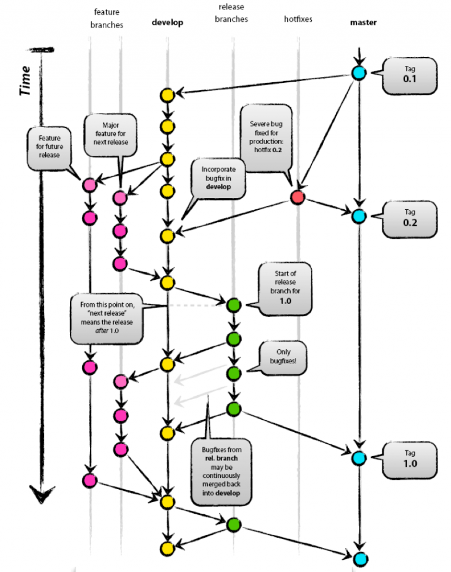
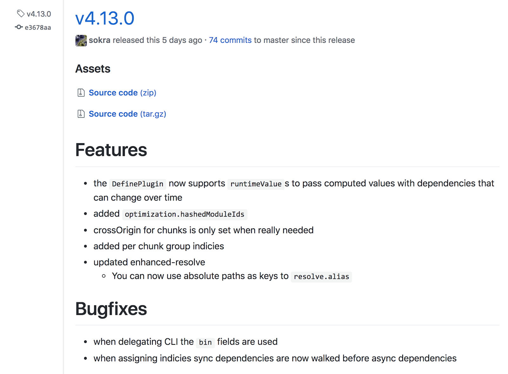

### Development & Release Management Process

#### Primary Branches:
***Main***:
    
1. Stable branch that is always production-ready 
1. Contains last release version of source code in production

***Develop***:
1. Derived from the main branch 
1. Used for integrating different features planned for an upcoming release

#### Secondary Branches:
***Feature***: 
1. Derived from the develop branch 
1. Used to develop features

***Release***: 
1. Derived from the develop branch
1. Used for release

***Hotfix***:
1. Derived from the main branch 
1. Used for fix a bug in the production branch(main branch), if bug identified after a release

**MAIN & DEVELOP BRANCHES:**
1. The main branch contains a version of the code that is in production
1. And the develop branch contains a version that is yet to be released in an upcoming version. 

**HOTFIX BRANCH:**
1. The hotfix branch is derived from the main branch and merged back after completion to develop and main branches.
    1. The release branch’s lifetime ends when it is merged to main branch & all the critical bug fixes for the production version are fixed.

**RELEASE BRANCH:**
1. The release branch helps isolate the development of an upcoming version and the current release.
1. This branch is created and used when features are completed and finalized for a versioned release. 
1. The sole purpose of the release branch is to isolate a version of a release that is final but needs some quality assistance and stability from the upcoming version.
1. The release branch derives from the develop branch and merges back into develop and main branches after completion of a release.
1. People who are working on the feature branches can continue working and merge their features into the develop branch without waiting on or affecting the release process. 
1. The release branch’s lifetime ends when a particular version of a project is released.
1. Once this branch merges into develop and main branches, it can be deleted. And once you have done this, we can tag a main branch with a particular release version—let’s say v1.0.0—to create a historical milestone.

**FEATURE BRANCH:**
1. The feature branch splits from the develop branch and merges back to the develop branch after a feature is complete. 
1. This branch is mostly created and used by developers collaborating with teams. The purpose of the feature branch is to develop small modules of a feature in a project.
1. If you are working in the develop branch directly, it would create a lot of conflicts and possibly break the existing code. Instead, if you branched off a separate feature branch, you could silently discard and delete that branch without affecting the develop branch.
1. Using separate feature branch also, we get an extra level of stability in the develop branch because code from the feature branch undergoes several levels of code reviews and quality assessment before merging into the develop branch.
1. If multiple developers are working on the same feature, it’s easier for them to collaborate by working on a common feature branch.
1. Even from feature branches, the developers can have their own branch & merge to the feature branch.

**RELEASE NOTES:**

Release notes are a way to track the changes that are part of a particular release and monitor the progress of a project over time. They are particularly helpful if you want to find out if a release contains a feature you’re interested in, need a reference of where a bug could have been introduced.

There can be a lot of automation done in future. But it is requested to all the developers while merging pull requests, make sure, writing good quality comments & notes. This notes & comments we can automate to document the release notes. This will drastically reduce the release note errors & improve the release note quality. 