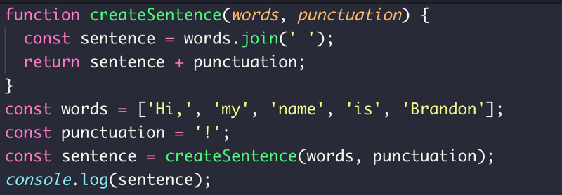
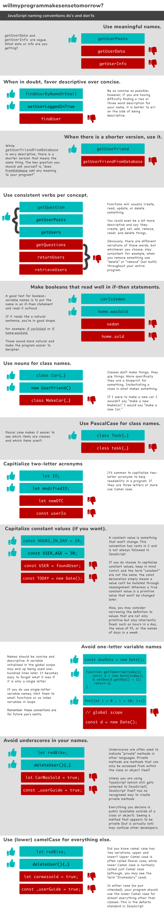

## JavaScript Naming Convention Best Practices

Take this simple program which creates a sentence from an array of words, adds a punctuation mark, and logs it to the console:



There are 23 words (not including hard-coded values) in the above program. We controlled the names of 14 of those words. That is more than 60% of what was typed, was our responsibility to name!


> ***Most of these conventions are not for you today, but instead, for you and the people reading your code tomorrow.***

### Rules
1. **JavaScript variable should be self-descriptive.**

    It should not be necessary to add a comment for additional documentation to the variable

    ```javascript
    // bad
    var value = 'GP';
     
    // bad
    var val = 'GP';
     
    // good
    var firstName = 'GP';
    ```

1. **JavaScript variables are declared with a `camelCase`**

    Most often JavaScript variables are declared with a **`camelCase`** , variable name with a leading lowercase character

    ```javascript
    // bad
    var firstname = 'gp';
     
    // bad
    var first_name = 'gp';
     
    // bad
    var FIRSTNAME = 'gp';
     
    // bad
    var FIRST_NAME = 'gp';
     
    // good
    var firstName = 'gp';
    ```
    
1. **JavaScript Naming Conventions: `Boolean`**

    A prefix like `is` , `are` , `has` helps every JavaScript developer to distinguish a boolean from another variable by just looking at it

    ```javascript
    // bad
    var visible = true;
     
    // good
    var isVisible = true;
     
    // bad
    var equal = false;
     
    // good
    var areEqual = false;
     
    // bad
    var encryption = true;
     
    // good
    var hasEncryption = true;
    ```

1. **JavaScript Naming Conventions: `Function`**

    JavaScript functions are written in **`camelCase`** too, it’s a best practice to actually tell what the function is doing by giving the **function name a verb as prefix**

    ```javascript
    // bad
    function name(firstName, lastName) {
      return `${firstName} ${lastName}`;
    }
     
    // good
    function getName(firstName, lastName) {
      return `${firstName} ${lastName}`;
    }
    ```
    This verb as prefix can be anything (e.g., `get` , `push` , `apply` , `calculate` , `compute` , `post` )

1. **JavaScript Naming Conventions: `Class`**

    A JavaScript class is declared with a **`PascalCase`** in contrast to other JavaScript data structures

    ```javascript
    class SoftwareDeveloper {
      constructor(firstName, lastName) {
        this.firstName = firstName;
        this.lastName = lastName;
      }
    }
     
    var me = new SoftwareDeveloper('GP', 'LEE');
    ```

1. **JavaScript Naming Conventions: `Component`**

    Components are widely declared with **`Pascal Case`** too

    ```javascript
    // bad
    function userProfile(user) {
      return (
        <div>
          <span>First Name: {user.firstName}</span>
          <span>Last Name: {user.lastName}</span>
        </div>
      );
    }
     
    // good
    function UserProfile(user) {
      return (
        <div>
          <span>First Name: {user.firstName}</span>
          <span>Last Name: {user.lastName}</span>
        </div>
      );
    }
    ```
    When a component gets used, it distinguishes itself from native HTML and web components, because its first letter is always written in uppercase

    ```html
    <div>
      <UserProfile
        user={{ firstName: 'Robin', lastName: 'Wieruch' }}
      />
    </div>
    ```

1. **JavaScript Naming Conventions: `Methods`**

    Identical to JavaScript functions, a method on a JavaScript class is declared with **`camelCase`**

    ```javascript
    class SoftwareDeveloper {
      constructor(firstName, lastName) {
        this.firstName = firstName;
        this.lastName = lastName;
      }
     
      getName() {
        return `${this.firstName} ${this.lastName}`;
      }
    }
     
    var me = new SoftwareDeveloper('GP', 'LEE');
     
    console.log(me.getName());
    // "GP LEE"
    ```
    Also, add a **verb as a prefix** for making the method name more self-descriptive

1. **JavaScript Naming Conventions: `Private`**

    **underscore (_)** for private variable in JavaScript. For instance, a private method in a class should only be used internally by the class, but should be avoided to be used on the instance of the class

    ```javascript
    class SoftwareDeveloper {
      constructor(firstName, lastName) {
        this.firstName = firstName;
        this.lastName = lastName;
        this.name = _getName(firstName, lastName);
      }
     
      _getName(firstName, lastName) {
        return `${firstName} ${lastName}`;
      }
    }
     
    var me = new SoftwareDeveloper('GP', 'LEE');
     
    // good
    var name = me.name;
    console.log(name);
    // "GP LEE"
     
    // bad
    name = me._getName(me.firstName, me.lastName);
    console.log(name);
    // "GP LEE"
    ```

1. **JavaScript Naming Conventions: `Constant`**

    Constants — intended to be non-changing variables — in JavaScript are written in **capital letters (UPPERCASE)**

    ```javascript
    var SECONDS = 60;
    var MINUTES = 60;
    var HOURS = 24;
     
    var DAY = SECONDS * MINUTES * HOURS;
    ```

1. **File names should be in `camelCase`**

    Like JavaScript variables are declared with **`camelCase`** , variable name with a leading lowercase character, same should be followed for file naming.

    ```javascript
    // good
    myComponent.js

    // bad
    MyComponent.js
    ```

### Special Notes:
1. If you are using data base in your project, then use same **`camelCase`** for naming the table column names, so that across the project name shall be consistant & shall have less issue while integration of Frontend, Backend & Database Modules.
1. If using SQL databases like MySQL, then use same name for foreign keys as the name in the original table. 

## Conclusion : do’s and don’ts


## References
[JavaScript naming conventions: do’s and don’ts](https://www.freecodecamp.org/news/javascript-naming-conventions-dos-and-don-ts-99c0e2fdd78a/)

[JavaScript Naming Convention Best Practices](https://medium.com/javascript-in-plain-english/javascript-naming-convention-best-practices-b2065694b7d)